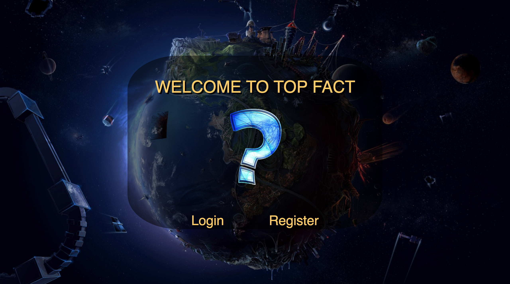

# The Legend of DBZ

## Why I am choosing this game?
* About a year ago, I was hooked on this game called trivia crack. I was hoping to recreate an app similiar to trivia crack.

=======

## Initial thoughts on game structure
* I know I will have to make items have collison detection.

* I will need to have variables to monitor the locations of each items x and y movements.

* I will need to have conditionals to test if items have collided. 

* I will need to have a life bar that decrements on each collison. 

* An animation functions needs to be used. 

## Phase of completion

* I needed to create wire frames highlighting the amount of items and elements need to be created and when each portion of data would be requested and stored.

* The first portion was creating the data/model structure. I needed to populate four different sql tables so that I can store the specific game the user requested and return to it later. The main purpose for this was to implement socket i.o and invite friends to the game, but I did not get around to it.

* After the layout and data structure was created, I had a good idea of the views I wanted to render. I began creating routes to implement those data structures.

* I then created the views with css and html structures in collaboration with database/javascript to piece together the project. I tested each phase.

* I ran into some issues trying to delete items since the tables are all dependent on eachother in some manner. 

## Links/Resources

* main background image 
http://all4desktop.com/data_images/1280%20x%20720/4180453-hi-tech-planet.jpg

